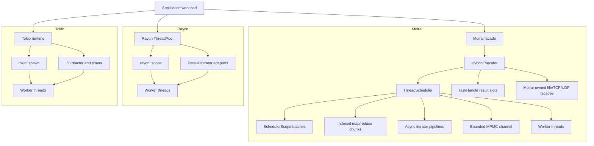
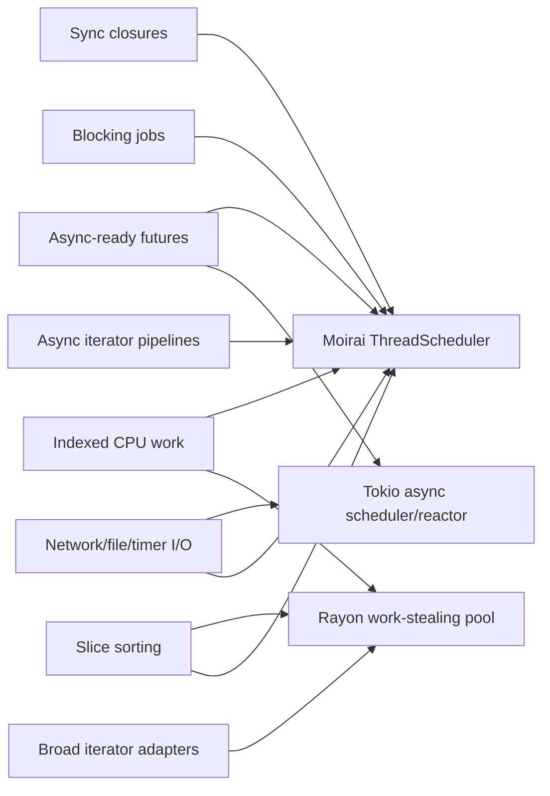
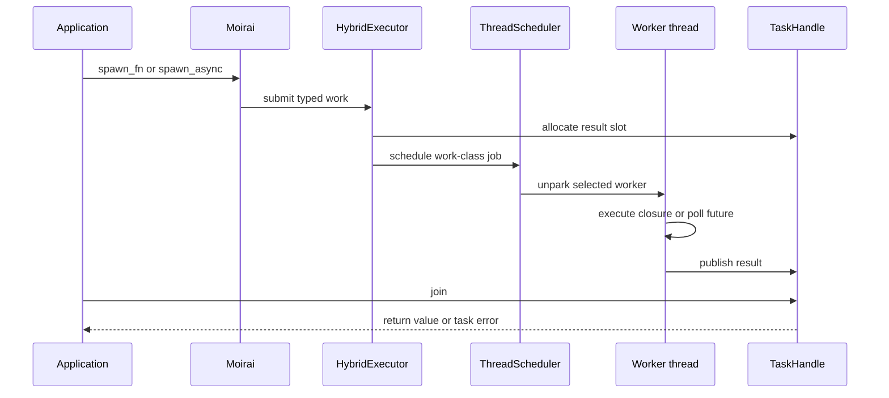
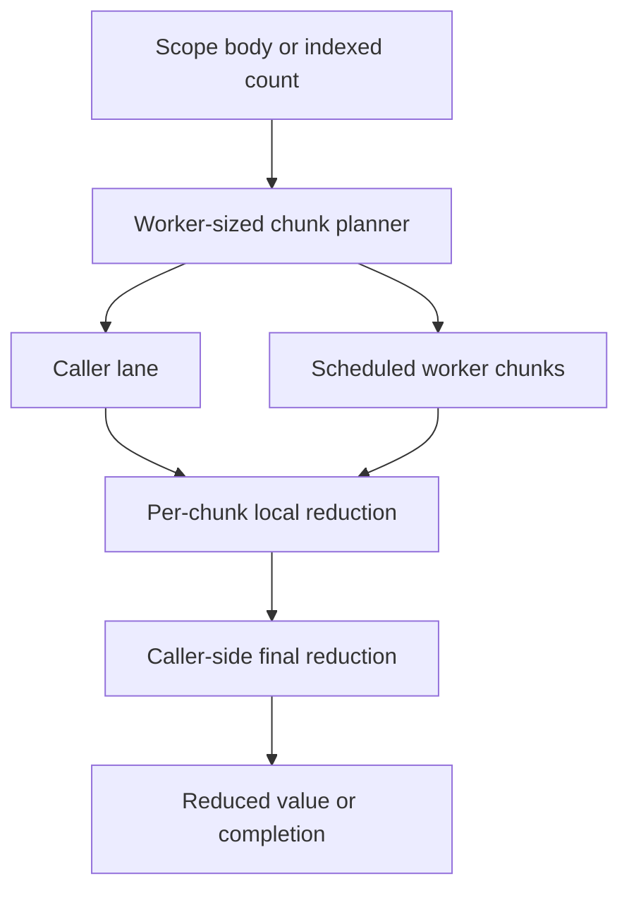
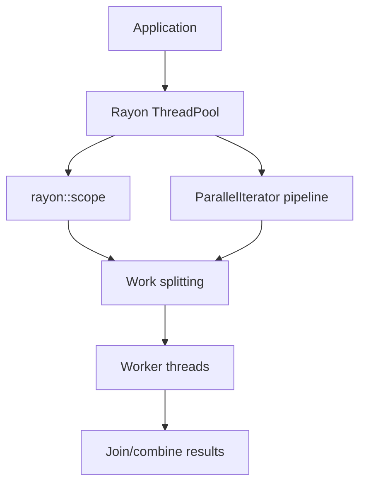
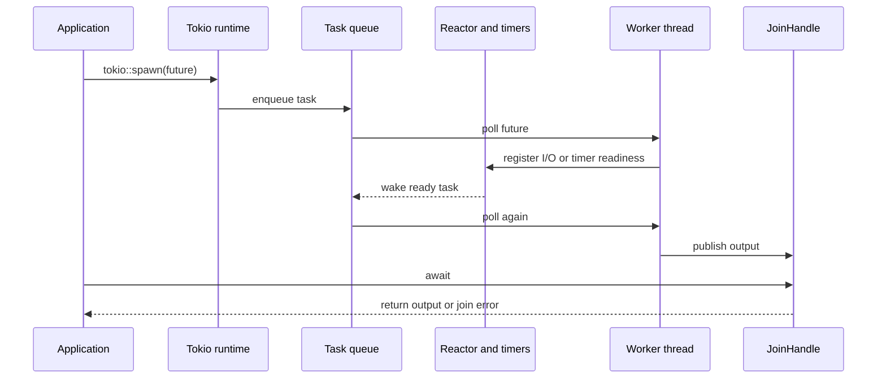
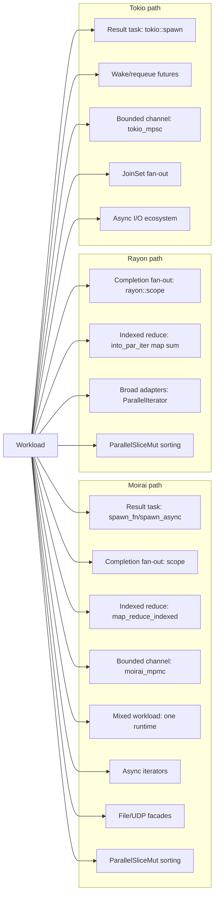

# Moirai, Rayon, and Tokio Comparison Report

## Scope

This report compares Moirai with Rayon and Tokio using repository-local evidence from:

- `README.md`
- `PERFORMANCE_RESULTS.md`
- `docs/rayon_tokio_gap_audit.md`
- `docs/rayon_adapter_surface_audit.md`
- `benchmarks/Cargo.toml`
- Public API surfaces in `moirai`, `moirai-executor`, and `moirai-iter`

The comparison covers the active Moirai scheduler scope: result-bearing task handles, completion-only scoped work, indexed map/reduce, bounded channel transfer, mixed async plus parallel work, iterator adapter coverage, async iterator coverage, native I/O extension futures, feature-gated Tokio I/O trait compatibility wrappers, the Moirai-owned file, TCP, and UDP facade benchmarks against Tokio, runtime dependency boundaries, and benchmark evidence. It does not claim full Tokio reactor-native I/O drop-in compatibility or full Rayon ecosystem parity.

## Executive Summary

Moirai is a unified concurrency runtime that combines async-ready task execution, completion-only scoped fan-out, and indexed CPU-parallel map/reduce behind one scheduler. Rayon specializes in CPU-bound data parallelism and scoped work. Tokio specializes in asynchronous I/O, task scheduling, timers, networking, synchronization, and runtime integration.

The repository's active comparison evidence supports this conclusion:

- Moirai is strongest when one runtime must coordinate sync work, async result handles, and indexed reductions without composing separate Tokio and Rayon runtimes.
- Rayon remains the broader and more mature choice for full ecosystem data-parallel ergonomics, but Moirai now covers the audited adapter subset, bounded exact-size indexed source cardinality, caller-provided indexed collection through `collect_into_vec` and `unzip_into_vecs`, indexed source interleaving through `interleave` and `interleave_shortest`, indexed fixed-stride source selection through `step_by`, logical-output indexed block adapters through `by_exponential_blocks` and `by_uniform_blocks`, `collect_vec_list`, terminal reducers, predicate terminals, `positions`, reference materialization, serial-inner `flat_map_iter` and `flatten_iter`, `take_any`, `skip_any`, `take_any_while`, `skip_any_while`, `intersperse`, `while_some`, `try_for_each`, `try_reduce`, `try_reduce_with`, `zip_eq`, `partition_map`, `unzip`, and a dedicated sorting slice-extension boundary with value-checked Rayon comparison rows.
- Tokio remains the broader and more mature async ecosystem runtime because Moirai's active audit covers task-result rows, async iterator rows, file facade read/write/append/metadata/rename/remove/copy rows, directory facade create/remove rows, and Moirai-owned TCP/UDP facade value benchmarks, not Tokio reactor-native I/O drop-in compatibility.
- Moirai's competitive benchmark rows are value-checked and keep Tokio/Rayon as benchmark-only dependencies, not production runtime dependencies.

Latest example-cleanup benchmark refresh: `cargo bench -p moirai-benchmarks --no-run` compiled all benchmark targets, while the full package benchmark exceeded the 300 second local gate and the maintained comparison targets were rerun individually. Moirai ready result handles measured 509.05-681.55 ns versus Tokio 1.5601-2.5055 us, scoped ready scheduling measured 12.700-12.955 us versus Tokio 2.1801-3.5275 ms and Rayon 47.117-98.944 us, indexed reduction measured 454.94-658.77 ns versus Rayon 3.8028-6.6470 us, mixed unified work measured 39.542-40.067 us versus Tokio plus Rayon 605.57-629.84 us, real-application mixed work measured 92.002-94.008 us versus Tokio plus Rayon 677.24-694.88 us, indexed `collect_into_vec` measured 52.772-54.366 us versus Rayon 94.521-99.820 us, `collect_vec_list` measured 75.452-84.155 us versus Rayon 471.67-490.59 us, TCP loopback measured 309.05-339.12 us versus Tokio 358.13-370.59 us, TCP persistent stream measured 17.764-19.724 us versus Tokio 23.766-24.201 us, and TCP write shutdown measured 445.28-461.16 us versus Tokio 494.87-503.21 us. The refreshed rows are empirical benchmark evidence, not formal proofs.

## Architectural Model

| Dimension | Moirai | Rayon | Tokio |
| --- | --- | --- | --- |
| Primary domain | Unified sync, blocking, async-ready, and indexed scheduler work | CPU-bound data parallelism | Async I/O and task runtime |
| Runtime model | One `Moirai` facade over `HybridExecutor` and `ThreadScheduler` | Work-stealing thread pool | Reactor plus async scheduler |
| Public task result path | `Moirai::spawn_fn`, `Moirai::spawn_async`, `TaskHandle::join` | No equivalent per-task public result handle in scoped rows | `tokio::spawn`, `JoinHandle::await` |
| Completion-only fan-out | `Moirai::scope` | `rayon::scope` | Spawn and await/join task sets |
| Indexed map/reduce | `Moirai::map_reduce_indexed` | `into_par_iter().map(...).sum()` and related adapters | Not a primary Tokio primitive |
| Bounded channel transfer | `moirai_core::channel::mpmc` | Not a primary Rayon primitive | `tokio::sync::mpsc::channel` |
| Mixed async plus parallel workload | One Moirai runtime | Requires composition with Tokio for async work | Requires composition with Rayon for CPU data parallelism |
| Production dependency boundary in this repo | Does not depend on Tokio or Rayon in runtime crates | Used as comparison dependency | Used as comparison dependency |

### Architecture Topology

Moirai's topology centers on one facade and one scheduler for the compared sync, async-ready, scoped, indexed, and async iterator paths. The file, TCP, and UDP benchmark rows are Moirai-owned facade slices driven by `Moirai::block_on` where runtime execution is required. Rayon centers on data-parallel worker-pool execution. Tokio centers on async task scheduling, timer, and I/O reactor integration.

### Scheduler Responsibility Split

This split captures the supported comparison boundary. Moirai and Rayon both cover indexed CPU work and the audited adapter/sorting rows. Tokio and Moirai both cover result-bearing async task semantics, bounded channel transfer, async iterator pipelines, file facade read/write/append/metadata/rename/remove/copy operations, directory facade create/remove operations, and UDP facade receives in matched rows. Tokio remains the primary runtime for broad async I/O integration, and Rayon remains the primary runtime for broad parallel iterator coverage.

## Moirai Strengths

### Unified Scheduler

Moirai exposes one public runtime for sync, blocking, and async-ready work. `HybridExecutor` routes these shapes through `ThreadScheduler` using zero-sized work-class markers (`SyncTask`, `AsyncTask`, and `BlockingTask`). This gives Moirai a single-engine path for workloads that would otherwise combine Tokio for async tasks and Rayon for CPU-bound work.

The active mixed benchmark covers that requirement directly: `thread_schedule_comparison -- mixed_unified_schedule` combines completion-only sync fan-out, async result handles, and indexed reduction through one Moirai runtime, with the reference row using Tokio plus Rayon.

### Result-Bearing Tasks

Moirai has a direct public result-handle path:

- `Moirai::spawn_fn`
- `Moirai::spawn_async`
- `TaskHandle::join`

The benchmark audit compares these rows against Tokio `JoinHandle` where semantics match. Rayon is not used as a result-handle baseline because Rayon scoped work is completion-oriented and does not expose an equivalent per-task result handle.

### Scoped and Indexed CPU Work

Moirai's active Rayon comparison is not the full `moirai-iter::parallel` adapter layer. The primary competitive path is:

- `Moirai::scope` versus `rayon::scope`
- `Moirai::map_reduce_indexed` versus fixed-pool Rayon `into_par_iter().map(...).sum()`

The repository documents value assertions for these benchmark paths, including closed-form checksum validation before timing.

### Moirai Scheduler Flow

For scoped and indexed work, Moirai avoids per-logical-item result handles where completion or reduction semantics are sufficient.

### Runtime Dependency Isolation

`benchmarks/Cargo.toml` includes Tokio and Rayon as comparison libraries. The active audit states that Tokio and Rayon must stay out of production runtime dependency sections. This preserves Moirai's runtime boundary and prevents benchmark references from becoming implementation dependencies.

## Rayon Comparison

### Where Moirai Matches or Competes

| Capability | Moirai path | Rayon path | Repository status |
| --- | --- | --- | --- |
| Completion-only scoped fan-out | `Moirai::scope` | `rayon::scope` | Covered |
| Indexed map/reduce | `Moirai::map_reduce_indexed` | `into_par_iter().map(...).sum()` | Covered |
| Worker-sized chunk execution | Scheduler chunking with caller participation | Rayon indexed worker pool | Covered |
| Indexed source cardinality | `IndexedParallelIterator::{len, is_empty}` | Rayon `IndexedParallelIterator::len` | Covered bounded source boundary |
| Indexed caller-provided collection | `IndexedParallelIterator::{collect_into_vec, unzip_into_vecs}` | Rayon `IndexedParallelIterator::{collect_into_vec, unzip_into_vecs}` | Covered bounded source boundary |
| Indexed source interleave | `IndexedParallelIterator::{interleave, interleave_shortest}` | Rayon `IndexedParallelIterator::{interleave, interleave_shortest}` | Covered bounded source boundary |
| Indexed source step-by | `IndexedParallelIterator::step_by` | Rayon `IndexedParallelIterator::step_by` | Covered bounded source boundary |
| Indexed source block adapters | `IndexedParallelIterator::{by_exponential_blocks, by_uniform_blocks}` | Rayon `IndexedParallelIterator::{by_exponential_blocks, by_uniform_blocks}` | Covered bounded logical-output boundary |
| Collect-vec-list terminal | `ParallelIterator::collect_vec_list` with flattened logical-output equivalence | Rayon `ParallelIterator::collect_vec_list` | Covered bounded terminal boundary |
| Audited parallel iterator style | `moirai-iter::parallel` subset | `ParallelIterator` | Covered subset |
| Sorting slice extension | `ParallelSliceMut` | Rayon `ParallelSliceMut` | Covered slice boundary |

### Rayon Scheduler Flow

Rayon's execution model is optimized for CPU-bound work stealing and rich iterator composition. In this repository, the direct competitive rows use fixed-size Rayon pools so Rayon and Moirai run with the same worker budget.

### Rayon Adapter Surface Boundary

`docs/rayon_adapter_surface_audit.md` states that Moirai does not currently provide full Rayon adapter parity. The supported subset includes:

- `IntoParallelIterator` for `Vec<T>` and `Range<usize>`
- `IntoParallelRefIterator` for `Vec<T>`
- bounded `IndexedParallelIterator::{len, is_empty}` for exact-size source iterators
- caller-provided indexed `collect_into_vec` and `unzip_into_vecs`
- indexed `interleave` and `interleave_shortest`
- indexed `step_by`
- indexed `by_exponential_blocks` and `by_uniform_blocks`
- `map`
- `filter`
- `inspect`
- `panic_fuse`
- `filter_map`
- `flat_map`
- `flat_map_iter`
- `flatten`
- `flatten_iter`
- `enumerate`
- `zip`
- `zip_eq`
- `copied`
- `cloned`
- `take`
- `skip`
- `take_any`
- `skip_any`
- `take_any_while`
- `skip_any_while`
- `chain`
- `intersperse`
- `rev`
- `chunks`
- `partition`
- `partition_map`
- `unzip`
- `collect`
- `collect_vec_list`
- `count`
- `any`
- `all`
- `find_any`
- `find_first`
- `for_each`
- `for_each_with`
- `for_each_init`
- `try_for_each`
- `try_for_each_with`
- `try_for_each_init`
- `try_reduce`
- `try_reduce_with`
- `reduce`
- `reduce_with`
- `sum`
- `product`
- `min`
- `max`
- `fold`
- `find_last`
- `position_any`
- `position_first`
- `position_last`
- `positions`
- `find_map_first`
- `find_map_any`
- `find_map_last`
- `map_with`
- `map_init`
- `update`
- `intersperse`
- `while_some`
- `ParallelExtend<T>` for `Vec<T>`
- `ParallelSliceMut` for stable and unstable slice sorting

Moirai exposes a bounded `IndexedParallelIterator` source-cardinality and logical-output adapter boundary for exact-size sources, but it does not expose Rayon's full indexed producer/consumer adapter model or full producer block-scheduling model. Indexed execution remains routed through the runtime facade methods. Sorting is implemented through `ParallelSliceMut` because it is a slice-extension boundary, not a `ParallelIterator` adapter.

### Practical Selection

Use Moirai over Rayon when:

- The workload needs CPU-parallel work and async-ready task handles in one runtime.
- Indexed map/reduce is enough for the data-parallel core.
- The benchmarked scheduler/result-handle paths map directly to the application workload.

Use Rayon over Moirai when:

- Full `ParallelIterator` adapter breadth is required.
- The workload is purely CPU-bound and benefits from Rayon's mature iterator ecosystem.
- Drop-in Rayon API compatibility is a requirement.

## Tokio Comparison

### Where Moirai Matches or Competes

| Capability | Moirai path | Tokio path | Repository status |
| --- | --- | --- | --- |
| Ready result task | `Moirai::spawn_fn` plus `TaskHandle::join` | `tokio::spawn` plus `JoinHandle::await` | Covered |
| Captured result task | `Moirai::spawn_fn` with captured data | `tokio::spawn` with captured data | Covered |
| Async result task | `Moirai::spawn_async` plus `TaskHandle::join` | `tokio::spawn` future | Covered |
| Wake/requeue async task | Wake-once `spawn_async` future | Wake-once Tokio task | Covered |
| Bounded channel transfer | `moirai_core::channel::mpmc` as `moirai_mpmc` in `bounded_channel_matrix` | `tokio::sync::mpsc::channel` as `tokio_mpsc` in `bounded_channel_matrix` | Covered |
| Ready async iterator pipeline | `moirai-iter::AsyncIterator` map/filter/materialize | Tokio `JoinSet` ready fan-out | Covered |
| Async iterator logical-window pipeline | `moirai-iter::AsyncIterator` map/take/skip/materialize | Tokio `JoinSet` ready fan-out over the same retained window | Covered |
| Async iterator enumerate/zip pipeline | `moirai-iter::AsyncIterator` map/zip/enumerate/materialize | Tokio `JoinSet` ready fan-out over both inputs | Covered |
| Bounded async iterator pipeline | `moirai-iter::AsyncParallelIterator` bounded `par_map`/`par_filter` | Tokio bounded `JoinSet` fan-out | Covered |
| Timer fanout | Moirai async sleep fanout | Tokio sleep fanout | Covered for benchmarked fanout |
| Native I/O extension futures | `moirai_async::io::{AsyncReadExt, AsyncWriteExt}` | Tokio-style `read_exact`, `write_all`, and `shutdown` extension semantics | Covered native trait slice |
| Tokio I/O trait adapters | `TokioCompat<T>` and `MoiraiCompat<T>` transparent wrappers under `tokio-compat` | `tokio::io::{AsyncRead, AsyncWrite}` | Covered trait slice through value tests and `async_io_compat_comparison` |
| File facade read | `moirai_async::fs::read` | `tokio::fs::read` | Covered |
| File facade write | `moirai_async::fs::write` through PAL platform write | `tokio::fs::write` | Covered |
| File facade append | `moirai_async::fs::append` through PAL platform append | `tokio::fs::OpenOptions::append` plus `write_all` | Covered |
| File facade metadata | `moirai_async::fs::metadata` through PAL platform metadata | `tokio::fs::metadata` | Covered |
| File facade rename | `moirai_async::fs::rename` through PAL platform rename | `tokio::fs::rename` | Covered |
| File facade remove | `moirai_async::fs::remove_file` through PAL platform remove | `tokio::fs::remove_file` | Covered |
| File facade copy | `moirai_async::fs::copy` through PAL platform copy | `tokio::fs::copy` | Covered |
| Directory facade create/remove | `moirai_async::fs::{create_dir, remove_dir}` through PAL platform directory operations | `tokio::fs::{create_dir, remove_dir}` | Covered |
| Directory facade recursive create/remove | `moirai_async::fs::{create_dir_all, remove_dir_all}` through PAL platform directory operations | `tokio::fs::{create_dir_all, remove_dir_all}` | Covered |
| Moirai-owned network facade value semantics | TCP loopback read/write, TCP write shutdown EOF, TCP write backpressure, TCP read readiness, TCP pending-read cancellation safety, and UDP loopback send/receive | Tokio TCP loopback echo, TCP write shutdown, TCP write backpressure, TCP read readiness, TCP pending-read cancellation safety, and UDP loopback receive are benchmarked against the same payloads or readiness contract | Covered facade slice |
| Tokio TCP loopback accept/echo | `moirai_async::net::TcpListener`/`TcpStream` | `tokio::net::TcpListener`/`TcpStream` | Covered facade slice through `async_tcp_comparison` / `async_tcp_loopback_echo` |
| Tokio TCP persistent stream echo | `moirai_async::net::TcpStream` | `tokio::net::TcpStream` | Covered facade slice through `async_tcp_comparison` / `async_tcp_stream_echo` |
| Tokio TCP write shutdown | `moirai_async::net::TcpStream` write-side shutdown | `tokio::net::TcpStream` write-side shutdown | Covered facade slice through `async_tcp_comparison` / `async_tcp_write_shutdown` |
| Tokio TCP write backpressure | `moirai_async::net::TcpStream::poll_write` over bounded socket buffers | `tokio::net::TcpStream::poll_write` over bounded socket buffers | Covered facade slice through `async_tcp_backpressure_comparison` / `async_tcp_write_backpressure` |
| Tokio TCP read readiness | `moirai_async::net::TcpStream::poll_read` before peer data | `tokio::net::TcpStream::poll_read` before peer data, then `readable` / `try_read` for payload delivery | Covered facade slice through `async_tcp_readiness_comparison` / `async_tcp_read_readiness` |
| Tokio TCP pending-read cancellation safety | borrowed `moirai_async::io::AsyncReadExt::read_exact` future dropped after `Poll::Pending` | borrowed `tokio::io::AsyncReadExt::read_exact` future dropped after `Poll::Pending` | Covered facade slice through `async_tcp_cancel_safety_comparison` / `async_tcp_pending_read_cancel_safety` |
| Tokio UDP loopback receive | `moirai_async::net::UdpSocket::recv_from` | `tokio::net::UdpSocket::recv_from` | Covered facade slice through `async_udp_comparison` / `async_udp_loopback_recv_from` |
| Tokio reactor-native I/O drop-in compatibility | Moirai-owned APIs; PAL native async file/network types still deferred | Tokio I/O APIs | Deferred |

### Tokio Scheduler Flow

Tokio's scheduler is paired with reactor and timer responsibilities. Moirai's matched Tokio rows cover task-result and wake/requeue semantics, while broader Tokio I/O compatibility remains outside the active comparison scope.

### Tokio Compatibility Gap

The active audit does not claim drop-in compatibility with every Tokio I/O type. `moirai_async::io` now provides covered native `read_exact`, `write_all`, and `shutdown` extension semantics without allocating extension-future state, plus feature-gated transparent `TokioCompat<T>` and `MoiraiCompat<T>` wrappers for `tokio::io` trait interoperability. `moirai-async::fs::{read, write, append, metadata, rename, remove_file, copy}` have covered 64 KiB benchmark rows against `tokio::fs::{read, write, metadata, rename, remove_file, copy}` and Tokio append-open/write; `moirai-async::fs::{create_dir, create_dir_all, remove_dir, remove_dir_all}` have covered directory facade rows against Tokio directory operations; the Moirai write, append, metadata, rename, remove, and directory facades delegate to PAL platform operations over caller data or path references, and the Moirai copy facade delegates to PAL platform copy instead of allocating a user-space transfer buffer. `moirai-async::net` has Moirai-owned TCP loopback accept/echo, TCP persistent stream echo, TCP write shutdown, TCP write backpressure, TCP read readiness, TCP pending-read cancellation safety, and UDP loopback receive benchmark rows against Tokio plus TCP/UDP module value tests. The TCP targets are `async_tcp_comparison` with rows `async_tcp_loopback_echo`, `async_tcp_stream_echo`, and `async_tcp_write_shutdown`, `async_tcp_backpressure_comparison` with row `async_tcp_write_backpressure`, `async_tcp_readiness_comparison` with row `async_tcp_read_readiness`, and `async_tcp_cancel_safety_comparison` with row `async_tcp_pending_read_cancel_safety`; the UDP target is `async_udp_comparison` and its row is `async_udp_loopback_recv_from`. Moirai rows in runtime-driven I/O comparison benchmarks use `Moirai::block_on`, while readiness and cancellation rows directly poll readiness contracts for both Moirai and Tokio. PAL TCP types register active-reactor wakers and self-wake when no active reactor is installed; PAL TCP shutdown delegates to `StdTcpStream::shutdown(Shutdown::Write)`; PAL reactor task handles publish ready-task completion; PAL reactor platform dispatch avoids `dyn` dispatch; PAL queued futures use bounded inline storage plus monomorphized poll/drop dispatch in the covered native path. Tokio reactor-native I/O drop-in compatibility remains deferred until PAL file readiness, OS I/O cancellation, and full reactor-native behavior are specified and benchmarked.

### Practical Selection

Use Moirai over Tokio when:

- The workload mixes async-ready handles with CPU-parallel scheduler work.
- The task model fits Moirai's `spawn_fn`, `spawn_async`, `scope`, and indexed reduction APIs.
- The application needs a benchmarked single-runtime alternative to composing Tokio with Rayon.

Use Tokio over Moirai when:

- The workload is primarily network, file, timer, or stream I/O.
- Compatibility with Tokio ecosystem crates is required.
- Runtime integration with Tokio-native libraries is the dominant constraint.

## Benchmark Evidence

The current repository records benchmark evidence in `PERFORMANCE_RESULTS.md`, `docs/rayon_tokio_gap_audit.md`, and `docs/rayon_adapter_surface_audit.md`. The latest documented comparison rows include:

| Benchmark group | Moirai result | Reference result | Interpretation |
| --- | ---: | ---: | --- |
| Ready result handle | 509.05-681.55 ns | Tokio 1.5601-2.5055 us | Moirai is ahead for ready result handles in the latest focused public comparison rerun |
| Captured result handle | 386.76-414.42 ns | Tokio 1.2970-1.3807 us | Moirai is ahead for captured ready result handles |
| Oversized captured result handle | 515.32-556.14 ns | Tokio 1.5046-1.6921 us | Moirai is ahead while retaining typed boxed inline trampoline storage |
| Async-ready result handle | 496.95-545.67 ns | Tokio ready `JoinHandle` 1.2135-1.3928 us | Moirai is ahead for the equivalent ready async task row |
| Wake-once async result handle | 531.01-623.14 ns | Tokio 1.3826-1.6928 us | Moirai is ahead for wake/requeue result-handle semantics |
| Scoped ready schedule | 12.700-12.955 us | Tokio 2.1801-3.5275 ms; Rayon 47.117-98.944 us | Moirai scoped batching is ahead for the documented focused scheduler rerun |
| Indexed reduce schedule | 454.94-658.77 ns | Rayon 3.8028-6.6470 us | Moirai indexed reduction is ahead for the documented focused scheduler rerun |
| Mixed unified schedule | 39.542-40.067 us | Tokio plus Rayon 605.57-629.84 us | Latest `mixed_unified_schedule` row keeps the one-runtime Moirai path ahead |
| Real application mixed workload | 92.002-94.008 us | Tokio plus Rayon 677.24-694.88 us | `real_application_mixed_workload` combines async fan-out, scoped request work, indexed analytics, bounded channel transfer, and a closed-form checksum |
| Public async wake-once handle | 513.57-544.64 ns | Tokio `JoinHandle` wake-once 1.2109-1.2496 us | `public_result_handle_ready` asserts `WakeOnce` returns 42 after one pending wake |
| Direct scoped completion | 294.01-313.60 ns | Rayon `scope` 575.96-624.94 ns | `public_result_handle_ready` asserts the scoped value is published before timing |
| Async sleep fanout | 15.518-15.636 ms | Tokio 15.356-15.597 ms | Intervals overlap; no clear Moirai advantage is claimed |
| Ready async iterator pipeline, 32,768 items | 404.46-590.99 us | Tokio `JoinSet` 24.904-25.380 ms | Moirai is ahead for equality-checked ready map/filter materialization |
| Async iterator take/skip pipeline, 32,768 items | 85.602-86.859 us | Tokio `JoinSet` 23.593-23.921 ms | `async_iterator_take_skip_pipeline` asserts equal transformed retained collections before timing |
| Async iterator enumerate/zip pipeline, 32,768 items | 672.68-734.62 us | Tokio `JoinSet` 48.260-49.144 ms | `async_iterator_enumerate_zip_pipeline` asserts equal ordered pair/index checksum before timing |
| Bounded async iterator one-pending-poll pipeline | 1.9756-1.9836 ms | Tokio `JoinSet` 9.5598-9.7768 ms | Moirai is ahead for bounded in-flight async map/filter |
| File facade read, 64 KiB | 39.127-45.710 us | Tokio `fs::read` 96.964-100.34 us | Moirai file facade row is ahead after byte equality assertions |
| File facade write, 64 KiB | 2.8650-3.4698 ms | Tokio `fs::write` 2.5939-3.2074 ms | Moirai delegates to PAL platform write over the caller slice; the Tokio row is faster in this same-run measurement |
| File facade append, 64 KiB | 272.59-291.93 us | Tokio append-open/write 190.29-320.18 us | Intervals overlap after prefix plus appended byte assertions |
| File facade copy, 64 KiB | 536.26-604.18 us | Tokio `fs::copy` 541.41-716.30 us | Moirai delegates to PAL platform copy and asserts copied byte counts plus destination byte equality |
| Directory facade create/remove | 228.49-251.78 us | Tokio `fs::create_dir`/`remove_dir` 275.03-287.74 us | Moirai delegates to PAL platform directory operations and asserts directory state |
| Directory facade recursive create/remove | 2.8710-3.1976 ms | Tokio `fs::create_dir_all`/`remove_dir_all` 3.8355-4.2147 ms | Moirai delegates to PAL platform directory operations and asserts nested marker bytes plus root removal |
| I/O compat read_exact, 4 KiB | 2.5060-2.6553 us | Tokio traits through `TokioCompat` 2.4962-2.6191 us | Transparent trait wrapper row overlaps native Moirai extension future timing after byte equality assertions |
| I/O compat write/shutdown, 4 KiB | 179.85-191.55 ns | Tokio traits through `TokioCompat` 186.41-195.91 ns | Transparent trait wrapper row adds a small measured adapter cost while preserving payload and shutdown assertions |
| TCP loopback echo, 24 bytes | 309.05-339.12 us | Tokio `TcpListener`/`TcpStream` 358.13-370.59 us | `async_tcp_loopback_echo` asserts Moirai and Tokio request/echo bytes before timing |
| TCP persistent stream echo, 24 bytes | 17.764-19.724 us | Tokio `TcpStream` 23.766-24.201 us | `async_tcp_stream_echo` asserts Moirai and Tokio request/echo bytes over established streams before timing |
| TCP write shutdown, 19 bytes | 445.28-461.16 us | Tokio `TcpStream` 494.87-503.21 us | `async_tcp_write_shutdown` asserts peer payload and EOF after write-side shutdown |
| TCP write backpressure, 16 KiB chunks | 20.171-61.392 ms | Tokio `TcpStream` 16.257-43.003 ms | `async_tcp_write_backpressure` asserts positive writes until backpressure through `async_tcp_backpressure_comparison` |
| TCP read readiness, 5 bytes | 564.43-903.33 us | Tokio `TcpStream` 474.64-739.83 us | `async_tcp_read_readiness` asserts `Poll::Pending` before peer data and exact payload bytes after release |
| TCP pending-read cancellation, 5 bytes | 299.08-340.01 us | Tokio `TcpStream` 339.36-368.55 us | `async_tcp_pending_read_cancel_safety` drops a pending borrowed read future, asserts the cancelled buffer is unchanged, then asserts exact payload bytes after release |
| UDP loopback receive, 27 bytes | 6.1554-6.4334 us | Tokio `UdpSocket::recv_from` 6.2846-6.4721 us | Same-payload UDP facade receive intervals overlap closely, with Moirai slightly lower in this run |
| Bounded channel p1/c1 | 1.4157-1.4504 ms | Tokio MPSC 2.5089-2.6101 ms | Moirai MPMC remains ahead in the latest documented bounded workload, with variance tracked |
| Standalone deque reclamation default | 2.1955-2.2040 us | Shared epoch policy 6.3355-6.4715 us | Diagnostic row keeps zero-sized `QuiescentReclaim` as the production default |
| Utility SIMD vector prefix/tail | 10.593-11.496 ns (65), 303.97-497.13 ns (4,099), 1.5658-2.0635 us (16,385) | Scalar 54.657-85.843 ns, 3.4924-5.9176 us, 14.469-20.229 us | Zero-cost utility invariant row; not a Rayon/Tokio competitive comparison |
| Iterator indexed pipeline | 35.664-35.796 us | Rayon 318.76-322.01 us | Moirai adapter row is ahead after value assertion |
| Iterator indexed unzip-into-vecs | 256.72-273.34 us | Rayon 268.81-303.00 us | `iterator_indexed_unzip_into_vecs` asserts equal side vectors and checksums before timing and unit tests cover non-`Clone` pair movement |
| Iterator indexed interleave | 401.13-439.28 us | Rayon 433.44-453.31 us | `iterator_indexed_interleave` asserts equal full and shortest interleaved vectors before timing and unit tests cover non-`Clone` movement plus exact shortest-tail drops |
| Iterator indexed step-by | 24.335-25.830 us | Rayon 65.191-67.990 us | `iterator_indexed_step_by` asserts equal stepped vectors before timing and unit tests cover non-`Clone` movement, exact length, zero-step rejection, and skipped-value drops |
| Iterator indexed block adapters | 30.128-32.300 us | Rayon 4.4301-4.5698 ms | `iterator_indexed_blocks` asserts equal `(first, collected)` outputs before timing and unit tests cover non-`Clone` movement, zero-sized policy markers, and zero uniform block rejection |
| Iterator collect-vec-list | 75.452-84.155 us | Rayon 471.67-490.59 us | `iterator_adapter_collect_vec_list` asserts equal flattened `(len, sum, xor)` summaries before timing and unit tests cover non-`Clone` movement plus empty-list behavior |
| Iterator filter/flat pipeline | 79.134-123.35 us | Rayon 393.06-405.26 us | `iterator_adapter_filter_flat_pipeline` asserts equal serial-inner `flat_map_iter` collections before timing |
| Iterator flatten | 73.234-74.541 us | Rayon 150.08-155.19 us | `iterator_adapter_flatten` asserts equal serial-inner `flatten_iter` collections before timing |
| Iterator take-any/skip-any | 26.930-27.464 us | Rayon 792.01-855.45 us | `iterator_adapter_take_skip_any` asserts equal constant-output retained collections before timing |
| Iterator take-any-while/skip-any-while | 91.813-102.11 us | Rayon 729.10-756.49 us | `iterator_adapter_take_skip_any_while` asserts equal full-pass predicate-window outputs before timing; unit tests cover deterministic prefix/suffix early-stop semantics |
| Iterator stateful map | 1.2630-1.3841 ms | Rayon 4.4604-21.486 ms | `iterator_adapter_map_state` asserts equal `(map_with, map_init)` mapped collections and checksums before timing |
| Iterator update mutation | 35.583-37.854 us | Rayon 373.83-393.54 us | `iterator_adapter_update` asserts equal updated collections before timing |
| Iterator intersperse | 91.120-94.203 us | Rayon 418.76-433.66 us | `iterator_adapter_intersperse` asserts equal separator-expanded collections before timing |
| Iterator chain/rev | 17.993-18.389 us | Rayon 76.454-80.386 us | Moirai adapter row is ahead after value assertion |
| Iterator zip-eq | 107.34-142.67 us | Rayon 364.99-373.05 us | `iterator_adapter_zip_eq` asserts equal mapped pair collections before timing and unit tests cover mismatch panic semantics |
| Iterator inspect/chunks | 31.061-31.810 us | Rayon 36.916-38.040 us | Moirai adapter row is ahead after value assertion |
| Iterator while-some | 118.97-188.35 us | Rayon 363.93-379.84 us | `iterator_adapter_while_some` asserts equal all-present optional-stream unwrapped collections before timing |
| Iterator try-for-each | 142.55-149.28 us | Rayon 932.60 us-1.1186 ms | `iterator_adapter_try_for_each` asserts equal atomic checksums before timing |
| Iterator stateful for-each | 453.72-518.46 us | Rayon 7.0571-11.419 ms | `iterator_adapter_for_each_state` asserts equal `(for_each_with, for_each_init)` checksum tuple before timing |
| Iterator fallible stateful for-each | 720.44 us-1.0202 ms | Rayon 5.6971-39.419 ms | `iterator_adapter_try_for_each_state` asserts equal `(try_for_each_with, try_for_each_init)` checksum tuple before timing |
| Iterator try-reduce | 20.183-21.585 us | Rayon 75.866-79.962 us | `iterator_adapter_try_reduce` asserts equal reduced checksums before timing |
| Iterator try-reduce-with | 8.5426-8.7513 us | Rayon 64.753-66.248 us | `iterator_adapter_try_reduce_with` asserts equal `Option<Result<_, _>>` outputs before timing |
| Iterator partition | 29.242-30.103 us | Rayon 658.16-693.21 us | Moirai adapter row is ahead after value assertion |
| Iterator partition-map | 32.468-32.719 us | Rayon 587.36-620.15 us | `iterator_adapter_partition_map` asserts equal left and right mapped collections before timing |
| Iterator terminal reducers | 64.686-65.272 us | Rayon 218.10-226.27 us | `iterator_adapter_terminal_reducers` asserts equal `(sum, min, max)` before timing |
| Iterator ordered reducers | 179.38-190.67 us | Rayon 3.3072-5.9357 ms | `iterator_adapter_ordered_reducers` asserts equal `(min_by, max_by, min_by_key, max_by_key)` before timing |
| Iterator find-map terminals | 77.948-85.530 us | Rayon 238.34-242.20 us | `iterator_adapter_find_map` asserts equal `(find_map_first, find_map_any, find_last, find_map_last)` before timing |
| Iterator position terminals | 33.601-43.300 us | 13.150-41.006 ms | `iterator_adapter_position` asserts equal `(position_first, position_any, position_last)` before timing |
| Iterator positions adapter | 11.248-11.339 us | Rayon 234.78-239.80 us | `iterator_adapter_positions` asserts equal index vectors before timing and uses fused mapped-stream routing |
| Iterator ref copy/clone | 1.9997-2.0162 ms | Rayon 3.0533-3.1264 ms | `iterator_adapter_ref_copy_clone` asserts equal copied and cloned collections before timing |
| Iterator unzip | 63.013-63.838 us | Rayon 648.79-671.82 us | `iterator_adapter_unzip` asserts equal left and right collections before timing |
| Stable slice sort | 76.225-78.202 us | Rayon 143.38-146.10 us | Moirai `ParallelSliceMut::par_sort` is ahead in the documented row |
| Unstable slice sort | 48.838-51.041 us | Rayon 66.725-69.234 us | Moirai `ParallelSliceMut::par_sort_unstable` is ahead in the documented row |

These results are benchmark-specific. They are not general claims that Moirai dominates Rayon or Tokio across their full ecosystems.

## Scheduler Comparison Matrix

The competitive rows are the matched paths: Moirai result tasks against Tokio result tasks, Moirai bounded channel transfer against Tokio bounded channel transfer through `channel_matrix` and `bounded_channel_matrix`, Moirai async iterators against Tokio `JoinSet` fan-out, Moirai scoped completion against Rayon scoped completion, Moirai indexed reduction against Rayon indexed reduction, Moirai sorting against Rayon `ParallelSliceMut`, Moirai file/directory/TCP/UDP facade slices against Tokio file/directory/TCP/UDP APIs, and Moirai mixed scheduling against a composed Tokio plus Rayon reference.

## Verification Discipline

The active benchmark policy requires:

- Value assertions before timing.
- Closed-form checksum validation where applicable.
- Bounded Criterion sample, warm-up, and measurement windows.
- Separate result-handle and completion-only benchmark rows.
- Runtime dependency boundary checks keeping Tokio and Rayon out of production dependency sections.
- Source-contract tests for zero-cost invariants such as monomorphized task dispatch, inline scheduled-job storage, concrete future storage, concrete iterator channel split/merge types, PAL static reactor dispatch, and contiguous standalone deque storage.

## Risk Register

| Risk | Impact | Current mitigation |
| --- | --- | --- |
| Full Rayon ecosystem parity is incomplete | Moirai cannot be marketed as drop-in Rayon-compatible | Adapter audit documents the covered subset, sorting boundary, indexed boundary, and value-checked rows for optional, fallible, stateful, position, reference, and reducer terminals |
| Tokio reactor-native I/O drop-in compatibility is deferred | Moirai cannot be marketed as drop-in Tokio-compatible | Tokio comparison scope is limited to matched scheduler/task/timer semantics plus covered file, TCP, and UDP facade rows |
| Benchmark variance exists in several rows | Performance claims can overfit local runs | Same-run references, bounded Criterion settings, and retained rejection notes |
| `moirai-iter::parallel` is not the active competitive Rayon path | Users may confuse adapter subset with scheduler benchmark path | Audit separates adapter surface from indexed runtime facade |
| Mixed-runtime advantage depends on workload shape | Moirai may not win for pure async I/O or broad iterator-heavy workloads | Selection guidance distinguishes Moirai, Rayon, and Tokio domains |

## Recommendation

Moirai should be positioned as a unified concurrency runtime, not as a direct replacement for all of Rayon or all of Tokio. The strongest supported claim is narrower and more defensible:

> Moirai provides a single runtime for result-bearing tasks, completion-only scoped work, and indexed map/reduce, with value-checked benchmarks against matched Tokio and Rayon reference paths.

Future comparison work should prioritize:

1. Continue the Tokio reactor-native I/O compatibility ADR with concrete reactor, network, file, timer, readiness, cancellation, and backpressure contracts.
2. Expand remaining Rayon ecosystem surfaces only when a dedicated Moirai boundary and value-checked Rayon benchmark exist.
3. Continue benchmark-contract enforcement that separates scheduler comparisons from ecosystem compatibility claims.
4. Continue scheduler handoff, async wake, and Criterion variance attribution before broadening claims beyond matched same-run comparisons.
